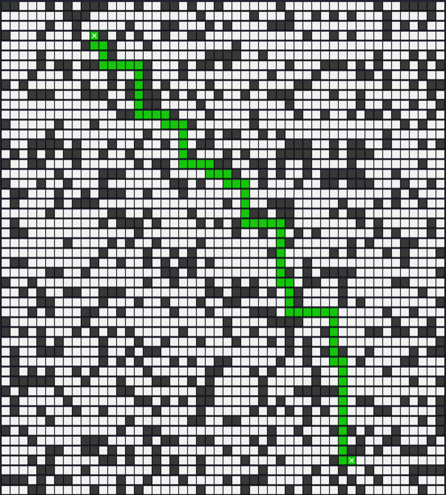

# Coche Autónomo

## Autores

- Vanessa Valentina Villalba Pérez
- Óscar Moreira Estévez
- Laura Ramallo Pérez

## Descripción del proyecto

Crear un programa que simule el comportamiento de un coche autónomo capaz de encontrar la salida a partir de la implementación del algoritmo *A** encontrando la mejor ruta posible.

Se utilizarán dos heurísticas diferentes para hacer los cálculos de las distancias entre dos puntos.
Estas dos heurísticas son:

- Manhattan: `h = abs (posicion_actual.x – posicion_destino.x) + abs (posicion_actual.y – posicion_destino.y)`

- Euclidean: ` h = sqrt ((posicion_actual.x – posicion_destino.x) * 2 + (posicion_actual.y – posicion_destino.y) * 2) `

El usuario debe tener la opción de introducir los datos de diferentes formas:

- Modo manual
- Entrada por fichero

En cada uno de ellos se podrá especificar las dimensiones del mapa, coordenadas de entrada y salida, posiciones de los obstáculos o introducirlos de forma aleatoria con un porcentaje.

A lo largo de la ejecución de este programa se mostrará por consola las diferentes características del mapa y el camino óptimo (en caso de que exista).

Finalmente se mostrarán la cantidad de nodos expandidos, la distancia desde la entrada a la salida y por último el tiempo que tarda en ejecutarse el algoritmo.


## Formato del fichero de entrada

El siguiente ejemplo veremos el tipo de formato que tendrá el fichero de entrada para introducir los datos necesarios del programa.

**Ejemplo modo manual obstáculos por fichero:**

```
10 10         # Dimensiones del mapa
2 2           # Coordenadas de entrada
8 9           # Coordenadas de salida
euclidean     # Función heurística escogida (euclidean o manhattan)
manual        # Tipo de introducción de obstáculos (manual o random)
6 6           # Coordenadas del obstáculo    
2 3           # Coordenadas del obstáculo
1 1           # Coordenadas del obstáculo
...           # Coordenadas del obstáculo
...           # Coordenadas del obstáculo
```

**Ejemplo modo random obstáculos por fichero:**

```
10 10         # Dimensiones del mapa
2 2           # Coordenadas de entrada
8 9           # Coordenadas de salida
euclidean     # Función heurística escogida (euclidean o manhattan)
random        # Tipo de introducción de obstáculos (manual o random)
30            # Porcentaje de obsáculos en el mapa
```

> En la carpeta **[files_map](./files_map/)** puedes encontrar ficheros como [map.txt](./files_map/map.txt) , [map2.txt](./files_map/map2.txt) y muchos más para poder ejecutarlos como ejemplo.


## Modo de ejecución

### Compilación del código

```console
  make
```

### Ejecución del programa con un fichero

```console
  ./main files_map/map.txt
```

### Ejecución del programa en modo manual

```console
  ./main
```

### Limpieza de los objetos creados

```console
  make clean
```

## Ejemplo de visualización final del proyecto

- **Casillas vacías:** ⬜
- **Obstáculos:** ⬛
- **Entrada:** 🟦
- **Salida:** 🟥
- **Salida y entrada final:** ❎
- **Ruta calculada:** 🟩

### Antes de calcular la ruta


### Ruta calculada




